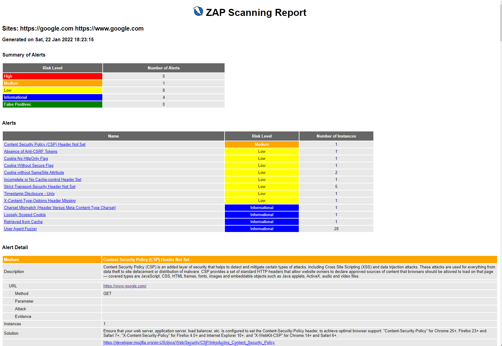

# Perform DAST scan

## Run 
```bash
$ docker run --rm -v /mnt/e/dev/docker/dast:/zap/wrk/:rw -t owasp/zap2docker-stable \
  /zap/zap-full-scan.py -t https://example.com.br -g gen.conf \
  -x OWASP-ZAP-Report.xml -r scan-report.html --hook=/zap/wrk/hooks.py
```



## Links:
+ https://www.zaproxy.org/docs/
+ https://www.zaproxy.org/docs/docker/about/
+ https://www.zaproxy.org/getting-started/
+ https://www.zaproxy.org/docs/docker/scan-hooks/
+ https://dzone.com/articles/owasp-zap-security-tests-in-azure-devops-pipeline
+ https://github.com/zaproxy/community-scripts/blob/main/scan-hooks/template.py